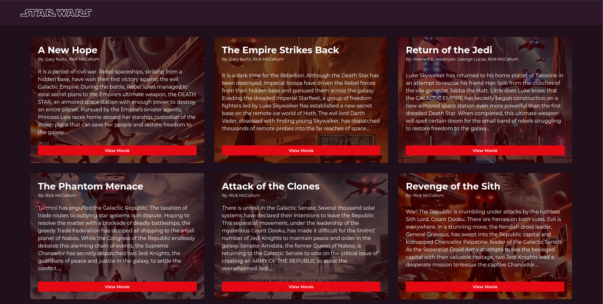
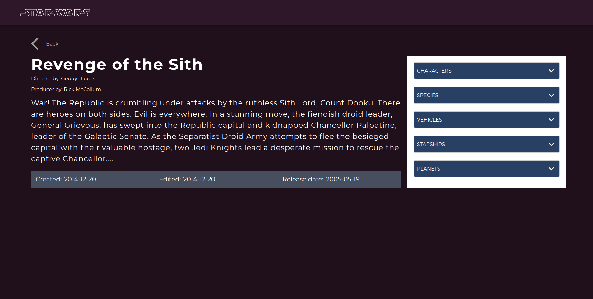

# 🌟 Star Wars Movies


## 📖 Description

A modern web application that showcases all Star Wars movies with details fetched from the Star Wars API. Browse through the iconic film series, view detailed information about each movie, and explore related characters, planets, and more.

## 🚀 Live Demo

Experience the application live: [Star Wars Movies App](https://star-wars-phi.vercel.app)

## 📸 Screenshots

Here are some screenshots from the application:


*The home page showing the list of Star Wars movies*


*Detailed view of a selected movie with information*

## ✨ Features

- **Movie Listing**: Browse through all Star Wars films in the saga
- **Detailed Information**: View comprehensive details about each movie
- **State Management**: Centralized state using Redux
- **Responsive Design**: Optimized for both desktop and mobile devices
- **Interactive UI**: User-friendly interface with smooth navigation

## 🛠️ Tech Stack

- **[React](https://reactjs.org/)**: JavaScript library for building user interfaces
- **[Redux](https://redux.js.org/)**: State management for application data flow
- **[Axios](https://www.npmjs.com/package/axios)**: Promise-based HTTP client for API requests
- **[Styled Components](https://www.styled-components.com/)**: CSS-in-JS library for component styling

## 🔧 Installation

Follow these steps to set up the project locally:

```bash
# Clone the repository (make sure you're running the master branch)
git clone https://github.com/SinethembaDlova/star-wars.git

# Navigate to the project directory
cd star-wars

# Install dependencies
npm install

# Start the development server
npm start
```

After running these commands, the application will be available at `http://localhost:3000`.

## 💻 Usage

1. Browse the list of Star Wars movies on the home page
2. Click on any movie to view its detailed information
3. Explore related data such as characters, planets, and vehicles
4. Use the back button to return to the movie listing

## 🧪 Testing

Run the test suite with:

```bash
# Run all tests
npm test

# Run tests with coverage report
npm test -- --coverage
```

## 🤝 Contributing

Contributions are welcome via pull-requests on feature branches using [Git Flow](https://danielkummer.github.io/git-flow-cheatsheet/).

```bash
# Create a feature branch
git flow feature start your-feature-name

# Make your changes and commit them
git add .
git commit -m "Add your feature"

# Publish the feature branch
git flow feature publish your-feature-name

# Finish the feature and merge to develop
git flow feature finish your-feature-name
```

## 📊 Project Structure

```
src/
├── api/            # API service functions and configurations
├── assets/         # Static assets like images, fonts, etc.
├── components/     # Reusable UI components
├── constants/      # Application constants and configuration
├── redux/          # Redux store, actions, and reducers
├── utils/          # Utility functions and helpers
└── views/          # Page components and layouts
```

## 📄 License

This project is licensed under the MIT License - see the LICENSE file for details.

## 👥 Contact

For questions or feedback, please open an issue on the [GitHub repository](https://github.com/SinethembaDlova/star-wars).